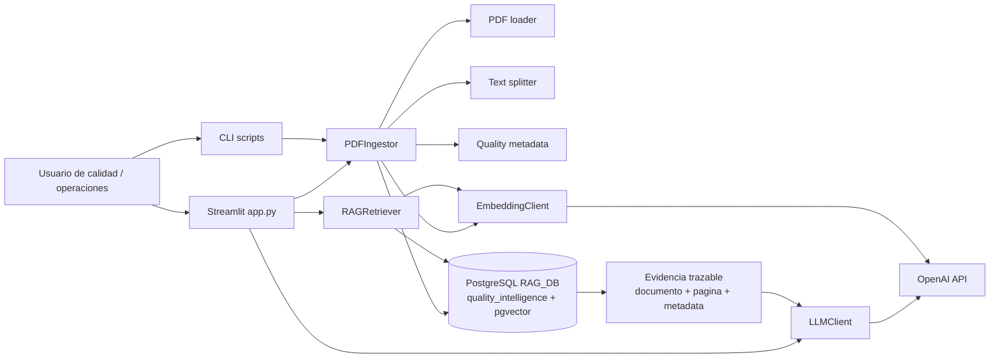
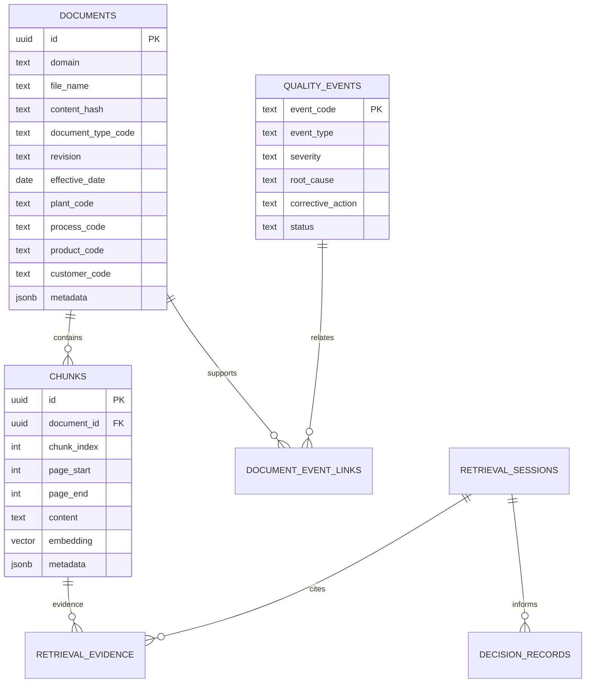

# Quality Intelligence Assistant


Sistema RAG profesional para inteligencia documental y soporte operativo basado
en evidencia. El objetivo no es crear un chatbot generico, sino una herramienta
para consultar, recuperar, interpretar y conectar informacion tecnica de calidad,
operaciones, Lean Six Sigma, manufactura, supply chain y QMS.

La base operativa del sistema es PostgreSQL (`RAG_DB`) y el esquema principal
del producto es `quality_intelligence`.

## Para que sirve

El asistente esta orientado a documentos como:

- SOPs y procedimientos.
- CAPA, desviaciones y no conformidades.
- Auditorias internas, externas, de cliente o proveedor.
- Reclamos de cliente.
- Especificaciones de producto, proceso, empaque o cliente.
- Reportes de calidad.
- Lecciones aprendidas.
- Proyectos DMAIC.
- Indicadores operativos.
- Documentacion QMS.

El sistema responde con evidencia recuperada, citas por documento/pagina,
contexto operativo y una estructura util para tomar decisiones.

## Business case

### Problema

En operaciones reales de calidad y manufactura, la informacion critica suele
estar distribuida entre procedimientos, especificaciones, CAPA, auditorias,
reclamos, reportes, indicadores y documentos QMS. Esto provoca:

- busquedas manuales lentas antes de tomar decisiones;
- dificultad para conectar reclamos, causas raiz, CAPA y auditorias;
- uso de documentos obsoletos o no aplicables;
- perdida de conocimiento entre plantas, turnos o equipos;
- preparacion reactiva ante auditorias;
- decisiones operativas con evidencia incompleta;
- alto tiempo invertido por ingenieros, coordinadores y gerentes en rastrear
  informacion documental.

### Propuesta de valor

El **Quality Intelligence Assistant** centraliza la inteligencia documental del
sistema de calidad y permite consultar evidencia tecnica con contexto operativo:
planta, proceso, producto, cliente, auditoria, tipo documental y fecha.

No reemplaza al responsable de calidad ni aprueba decisiones de forma automatica.
Su valor es acelerar el analisis, mostrar evidencia trazable y reducir el riesgo
de decisiones sin soporte documental.

### Usuarios objetivo

- Gerentes de calidad y operaciones.
- Ingenieros de calidad, proceso y mejora continua.
- Lideres Lean Six Sigma.
- Auditores internos.
- Responsables CAPA.
- Equipos de manufactura, supply chain y servicio al cliente.
- Analistas de QMS y documentacion.

### Casos de uso empresariales

- Preparacion de auditorias con evidencia por proceso, planta y requisito.
- Investigacion de reclamos conectando especificaciones, historial y CAPA.
- Analisis de recurrencia de no conformidades o hallazgos.
- Consulta rapida de SOPs vigentes y registros requeridos.
- Revision de riesgos antes de cambios de proceso o producto.
- Transferencia de lecciones aprendidas entre plantas.
- Soporte documental para proyectos DMAIC.
- Analisis de indicadores operativos con contexto de eventos de calidad.

### Impacto esperado

- Menor tiempo de busqueda documental.
- Mejor trazabilidad entre decision, evidencia y fuente.
- Mayor reutilizacion de conocimiento tecnico.
- Preparacion mas ordenada para auditorias.
- Reduccion de respuestas inconsistentes entre areas o plantas.
- Identificacion mas rapida de brechas documentales.
- Mejor soporte para priorizar CAPA, acciones preventivas y proyectos de mejora.

### Indicadores para medir valor

- Tiempo promedio para encontrar evidencia documental.
- Porcentaje de respuestas con cita valida por pagina/documento.
- Reduccion de hallazgos por falta de evidencia o documento incorrecto.
- Tiempo de preparacion de auditoria.
- Reutilizacion de CAPA/lecciones aprendidas en nuevos eventos.
- Porcentaje de consultas filtradas por planta, proceso, producto o cliente.
- Numero de brechas documentales detectadas antes de auditorias.

## Preguntas tipo

Estas preguntas muestran el tipo de interaccion esperada. El objetivo es obtener
respuestas basadas en evidencia, no opiniones genericas.

### SOPs y procedimientos

- Que procedimiento aplica para liberar este producto en esta planta?
- Que evidencias exige el SOP para cerrar esta etapa?
- Que registros son obligatorios segun el procedimiento?
- Quien es responsable de aprobar o ejecutar esta actividad?
- Que pasos del procedimiento impactan directamente al cliente?
- Hay diferencias entre el SOP actual y una revision anterior?
- Que controles se deben verificar antes de iniciar produccion?

### CAPA, causa raiz y recurrencia

- Que CAPA anteriores tuvieron una causa raiz parecida?
- Que acciones correctivas se usaron antes para este mismo defecto?
- Que evidencia existe de que la accion fue efectiva?
- Esta causa raiz relacionada con algun hallazgo de auditoria?
- Hay recurrencia por proceso, producto, cliente o planta?
- Que brechas de informacion impiden cerrar esta CAPA?

### Auditorias y cumplimiento

- Que hallazgos de auditoria se repiten por proceso?
- Que documentos debo revisar antes de una auditoria externa?
- Que evidencia necesito preparar para este requisito?
- Que hallazgos abiertos afectan a esta planta?
- Que procedimientos soportan este punto de la auditoria?
- Existe evidencia documental suficiente para demostrar cumplimiento?

### Reclamos de cliente

- Que especificacion del cliente define el criterio de aceptacion?
- Que reclamos similares se han recibido para este producto?
- Que CAPA o acciones se relacionan con este reclamo?
- Que lote, producto, proceso o planta aparece relacionado en la evidencia?
- Que respuesta tecnica puede sustentarse con documentos existentes?
- Que informacion falta antes de responder al cliente?

### Especificaciones y liberacion

- Cual es el criterio de aceptacion aplicable?
- Que especificacion vigente aplica a este producto y cliente?
- Que tolerancias o limites deben verificarse?
- Que documentos soportan la decision de aceptar o rechazar un lote?
- Hay conflicto entre especificacion interna y requerimiento de cliente?
- Que controles del proceso estan asociados a esta especificacion?

### Riesgo y decisiones operativas

- Que riesgos aparecen si cambio este parametro de proceso?
- Que impacto potencial existe para cliente, producto, proceso o compliance?
- Que evidencia soporta una decision de contencion?
- Que decision recomendada se puede tomar con la evidencia disponible?
- Que documentos estan vencidos, incompletos o sin aprobacion?
- Que brechas de informacion impiden responder con confianza?

### DMAIC, mejora continua e indicadores

- Que proyectos DMAIC han tratado un problema similar?
- Que causas potenciales se identificaron en proyectos anteriores?
- Que controles quedaron como parte del plan de control?
- Que indicadores muestran deterioro en este proceso?
- Que eventos de calidad coinciden con cambios en el KPI?
- Que lecciones aprendidas aplican a este nuevo proyecto?

## Funcionalidades principales

- Ingesta de PDFs con extraccion por pagina, hash SHA-256 y deduplicacion por
  contenido.
- Chunking con solape configurable y conservacion de `page_start` / `page_end`.
- Embeddings OpenAI almacenados en PostgreSQL + pgvector.
- Perfil especializado `quality_intelligence` para respuestas en contexto de
  calidad, manufactura, mejora continua y QMS.
- Filtros operativos en Streamlit:
  - planta / sitio
  - proceso / area
  - producto / SKU
  - cliente
  - tipo documental
  - auditoria / hallazgo
  - rango de fechas
- Retrieval semantico con diversificacion por documento.
- Citas trazables tipo `[S1] Documento, pp. 4-5`, con metadata de revision,
  vigencia, aprobacion y contexto operativo cuando esta disponible.
- Expansor de fuentes con score, archivo, metadata y extracto.
- Inferencia inicial de metadata QMS desde nombres controlados de archivo.
- Esquema SQL extendido para trazabilidad, evidencia, eventos de calidad,
  auditorias, DMAIC, indicadores y decisiones.
- Script para inicializar el esquema profesional `quality_intelligence`.

## Arquitectura



Flujo de trabajo:

1. El usuario coloca documentos tecnicos en `quality_knowledge_base/`.
2. La ingesta extrae texto, calcula hash, infiere metadata y genera chunks.
3. Los chunks se convierten en embeddings y se guardan en pgvector.
4. El usuario consulta usando filtros operativos.
5. El retriever combina similitud semantica, filtros y diversidad documental.
6. El LLM genera una respuesta basada solo en evidencia recuperada.
7. La UI muestra respuesta, citas, fuentes y metadata.

## Estructura del proyecto

- `app.py`: interfaz Streamlit del Quality Intelligence Assistant.
- `quality_knowledge_base/`: carpeta recomendada para documentos tecnicos a ingerir.
- `scripts/ingest_pdfs.py`: ingesta batch de PDFs.
- `scripts/init_quality_schema.py`: inicializa el esquema profesional QMS.
- `sql/001_quality_intelligence_schema.sql`: migracion PostgreSQL extendida.
- `docs/quality_intelligence_architecture.md`: arquitectura funcional completa,
  metadata, retrieval, roadmap, riesgos y buenas practicas.
- `src/quality_intelligence/config.py`: configuracion desde `.env`.
- `src/quality_intelligence/db.py`: persistencia PostgreSQL, pgvector, indices, filtros y
  busqueda semantica.
- `src/quality_intelligence/ingest.py`: pipeline de ingesta.
- `src/quality_intelligence/quality_metadata.py`: inferencia de metadata QMS desde nombres
  de archivo.
- `src/quality_intelligence/retriever.py`: retrieval y etiquetado de fuentes.
- `src/quality_intelligence/llm.py`: prompt final y llamada al modelo.
- `src/quality_intelligence/domain_profiles.py`: perfiles de dominio, incluyendo
  `quality_intelligence`.
- `src/quality_intelligence/pdf_loader.py`: lectura y hashing de PDFs.
- `src/quality_intelligence/text_splitter.py`: chunking con rango de paginas.
- `src/quality_intelligence/embeddings.py`: cliente de embeddings OpenAI.

## Modelo de datos

El modelo de datos esta disenado alrededor de dos tablas documentales centrales:

- `quality_intelligence.documents`
- `quality_intelligence.chunks`

Sobre esa base documental, el esquema incorpora tablas para contexto operativo,
trazabilidad, eventos de calidad, evidencia y decisiones:

- `document_types`: clasificacion documental.
- `plants`, `processes`, `products`, `customers`: dimensiones operativas.
- `quality_events`: CAPA, no conformidades, desviaciones, reclamos y hallazgos.
- `document_event_links`: relacion entre documentos y eventos.
- `audit_records`: auditorias y hallazgos.
- `dmaic_projects`: proyectos Lean Six Sigma.
- `operational_indicator_measurements`: KPIs por periodo.
- `retrieval_sessions`: preguntas, filtros y respuestas.
- `retrieval_evidence`: chunks usados como evidencia.
- `decision_records`: decisiones, racional, riesgo y evidencia asociada.



## Metadata recomendada

Metadata minima por documento:

- `document_type`: SOP, CAPA, AUDIT, COMPLAINT, SPECIFICATION, DMAIC, KPI, QMS.
- `document_code`, `revision`, `lifecycle_status`.
- `document_date`, `effective_date`, `review_due_date`.
- `plant`, `process`, `product`, `customer`.
- `owner_area`, `approval_status`, `approved_by`.
- `qms_process`, `risk_level`, `source_system`, `source_record_id`.

Metadata por chunk:

- `page_start`, `page_end`.
- `section_title`, `section_number`, `clause_ref`.
- `requirement_type`.
- `process_step`, `risk_signal`, `key_terms`.
- IDs detectados: CAPA, auditoria, reclamo, lote, SKU o cliente.

## Convencion de nombres para demo

Para que la metadata inicial funcione sin cargar un maestro externo, coloca los
PDFs en `quality_knowledge_base/` con esta convencion:

```text
<document_type>__<plant>__<process>__<product-or-customer>__<code>__rev-<revision>.pdf
```

Ejemplo:

```text
SOP__PlantaNorte__Empaque__SKU-100__SOP-QA-014__rev-03.pdf
CAPA__PlantaNorte__Empaque__SKU-100__CAPA-2026-008__rev-01.pdf
AUDIT__PlantaSur__Liberacion__Cliente-ACME__AUD-2026-014__rev-00.pdf
```

En produccion, la metadata deberia venir de QMS, SharePoint, ERP, MES, LIMS,
CRM, sistema de auditorias o sistema CAPA.

## Configuracion

`.env` contiene la configuracion local y no debe versionarse. `.env.sample`
contiene una plantilla segura.

Valores principales:

```text
DB_NAME=RAG_DB
RAG_DOMAIN=quality_intelligence
RAG_PDF_DIR=./quality_knowledge_base
OPENAI_CHAT_MODEL=gpt-5.2
OPENAI_EMBEDDING_MODEL=text-embedding-3-large
OPENAI_EMBEDDING_DIM=2000
```

Variables de base de datos:

- `DB_HOST`, `DB_PORT`, `DB_NAME`, `DB_USER`, `DB_PASSWORD`.
- `DB_SSLMODE`.
- `DB_EXTENSIONS_SCHEMA`, por defecto `extensions`.

Variables RAG:

- `RAG_DOMAIN`: esquema/dominio PostgreSQL.
- `RAG_PDF_DIR`: carpeta raiz con PDFs.
- `RAG_CHUNK_SIZE` y `RAG_CHUNK_OVERLAP`.
- `RAG_TOP_K`, `RAG_CANDIDATE_K`, `RAG_MAX_CHUNKS_PER_DOCUMENT`.
- `RAG_MAX_CONTEXT_CHARS`.
- `RAG_RECURSIVE_PDF_SCAN`: incluye subcarpetas dentro del repositorio documental.
- `RAG_PDF_TEXT_FALLBACK`: intenta fallback con `pdftotext` y, si esta instalado,
  OCR opcional con `ocrmypdf` cuando `pypdf` no extrae texto.

## Instalacion

Crear y activar el entorno:

```powershell
conda env create -f environment.yml
conda activate quality-intelligence
```

Tambien puedes usar `requirements.txt` con `pip` si prefieres otro entorno.

## Preparar PostgreSQL

La base objetivo es `RAG_DB`. El usuario configurado debe poder conectarse a
esa base y crear objetos dentro de ella.

Si la base no existe, creala con un usuario administrador:

```sql
CREATE DATABASE "RAG_DB";
```

Luego aplica el esquema profesional:

```powershell
conda run -n quality-intelligence python scripts\init_quality_schema.py --db-name RAG_DB
```

Si el usuario tiene permiso para crear bases:

```powershell
conda run -n quality-intelligence python scripts\init_quality_schema.py --db-name RAG_DB --create-db
```

Desde Streamlit puedes usar **Inicializar BD** para preparar el indice
documental. Para una instalacion completa del producto, ejecuta la migracion SQL
porque crea tambien las dimensiones operativas, eventos, auditorias, evidencia,
indicadores y decisiones.

## Ingestar documentos

Coloca PDFs en `quality_knowledge_base/` y ejecuta:

```powershell
conda run -n quality-intelligence python scripts\ingest_pdfs.py --pdf-dir .\quality_knowledge_base --domain quality_intelligence
```

Para reemplazar chunks de archivos ya indexados:

```powershell
conda run -n quality-intelligence python scripts\ingest_pdfs.py --pdf-dir .\quality_knowledge_base --domain quality_intelligence --force
```

Tambien puedes usar el boton **Ingerir PDFs** desde Streamlit.

## Ejecutar Streamlit

```powershell
conda run -n quality-intelligence streamlit run app.py --server.port 8501
```

O ejecuta `run_app.bat` en Windows.

La interfaz incluye:

- configuracion de dominio y carpeta documental;
- controles de chunking y retrieval;
- prueba de conexion con OpenAI;
- filtros operativos;
- tabla de documentos indexados;
- chat operacional;
- fuentes con score, documento, pagina, metadata y extracto.

## Buenas practicas de uso

- Usa filtros operativos antes de consultar temas de alto riesgo.
- Revisa siempre las fuentes citadas, especialmente revision y vigencia.
- No trates la respuesta como aprobacion formal automatica.
- Declara brechas cuando falten documentos, paginas, fechas o estado de
  aprobacion.
- Mantiene documentos obsoletos separados o marcados con metadata.
- Usa preguntas doradas para evaluar periodicamente la calidad del retrieval.

## Limitaciones y riesgos

- PDFs escaneados requieren OCR antes de la ingesta.
- Metadata incompleta reduce la precision de filtros.
- La similitud semantica puede recuperar documentos parecidos pero no aplicables.
- Documentos obsoletos pueden contaminar respuestas si no se controla vigencia.
- Causa raiz, riesgo y decision final requieren validacion humana.
- Informacion sensible de cliente, producto o proceso requiere controles de
  acceso antes de un despliegue empresarial.

## Roadmap sugerido

1. Base profesional: perfil `quality_intelligence`, filtros, metadata y esquema
   QMS.
2. Retrieval robusto: metadata externa, busqueda hibrida, reranking y penalizar
   documentos obsoletos.
3. Soporte a decisiones: registro de sesiones, evidencias y decisiones.
4. Demo empresarial: dataset simulado realista con casos de auditoria, reclamo,
   CAPA y DMAIC.
5. Producto Quality Analytics: conectores QMS/SharePoint/ERP, permisos, evals,
   monitoreo y despliegue controlado.

## Documentacion ampliada

La arquitectura funcional completa esta en:

```text
docs/quality_intelligence_architecture.md
```

Incluye detalle sobre tablas PostgreSQL, metadata QMS, tipos documentales,
flujos de retrieval, preguntas esperadas, trazabilidad, riesgo, decisiones,
roadmap, riesgos tecnicos y buenas practicas de embeddings/chunking.

## Licencia

Este repositorio es publico solo como demo, portafolio y material de evaluacion.
El codigo es **source-available**, pero no es open source.

No se concede permiso para usar, copiar, modificar, distribuir, desplegar,
revender, alojar, convertir en SaaS, incorporar en otro producto ni usar este
software en entornos comerciales, internos, de consultoria, capacitacion u
operacion sin autorizacion escrita previa.

El uso comercial, modificacion, redistribucion, despliegue, uso interno de
negocio, consultoria, capacitacion o incorporacion en otro producto requiere una
licencia comercial pagada.

Consulta `LICENSE.md` para los terminos completos.
