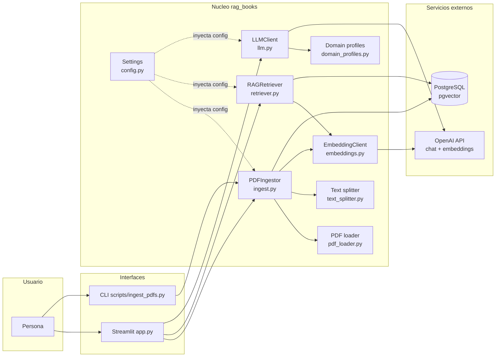
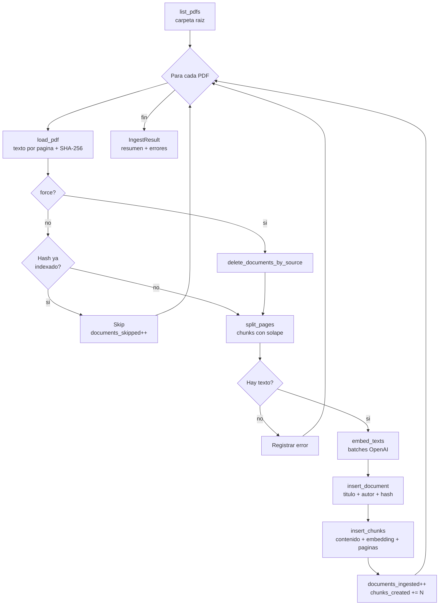
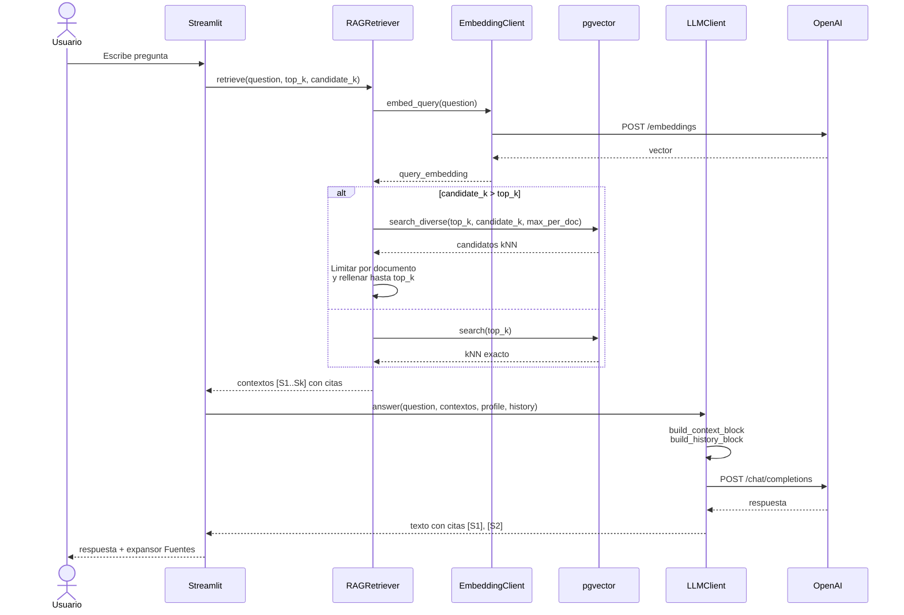
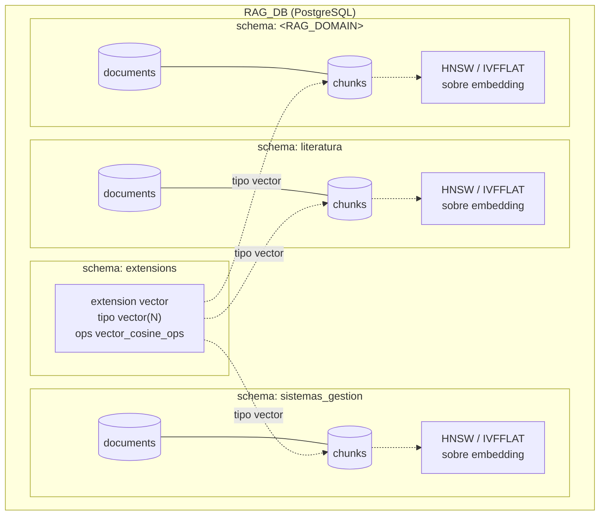
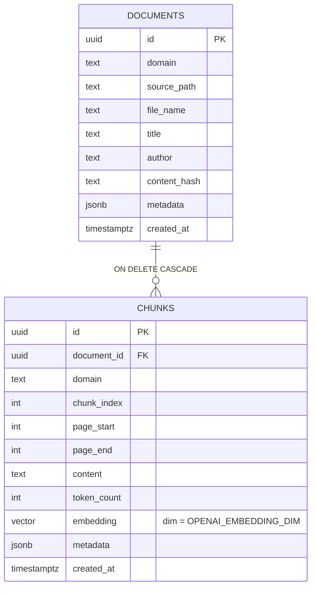

# RAG Books


Sistema **RAG (Retrieval-Augmented Generation)** parametrizable para libros literarios o documentos de otros dominios (por ejemplo, sistemas de gestion).
La base de datos es unica (`RAG_DB`) y cada dominio vive en su propio esquema PostgreSQL, lo que permite indexar y consultar corpus separados sin mezclar contextos.

## Arquitectura



## Stack

- **PostgreSQL** con extension `vector` (pgvector) para busqueda semantica con indices HNSW (fallback automatico a IVFFLAT).
- **Python 3.11+** como lenguaje principal.
- **OpenAI API** para embeddings (`text-embedding-3-large`, 2000 dim por defecto) y respuestas del LLM (`gpt-5.5` por defecto).
- **Streamlit** como interfaz web con chat, configuracion en barra lateral, panel de indice y vista de fuentes.
- **pypdf** para extraccion de texto pagina por pagina.
- **psycopg 3** como driver PostgreSQL.
- **Conda** para gestion del entorno (`environment.yml`).
- **Loguru** para logging estructurado con rotacion en disco.

## Licencia

Este proyecto se distribuye bajo la licencia Creative Commons Attribution-ShareAlike 4.0 International (CC BY-SA 4.0).
Consulta el archivo `LICENSE.md` para los términos completos.

## Funcionalidad

### Ingesta de PDFs

- Descubrimiento de PDFs en la **raiz** de la carpeta configurada (no recursivo).
- Extraccion de texto por pagina con `pypdf`, incluyendo metadatos de titulo y autor cuando estan presentes.
- **Deduplicacion por contenido**: cada PDF se identifica con un hash SHA-256; si el archivo no cambio, se omite la reingesta.
- **Modo `--force`** para reemplazar todos los chunks de un archivo y reingestar desde cero.
- Particion en chunks con tamano y solape configurables (`RAG_CHUNK_SIZE`, `RAG_CHUNK_OVERLAP`), con ajuste a fronteras naturales (oracion, parrafo, salto de linea).
- Conservacion del rango de paginas por chunk para citas precisas.



### Embeddings y almacenamiento

- Llamadas en lotes a la API de embeddings con limite por cantidad de textos y por caracteres totales.
- Soporte para dimensiones personalizadas en modelos `text-embedding-3-*`.
- Tabla `documents` y tabla `chunks` por esquema/dominio, con `UNIQUE` por `(domain, source_path, content_hash)` y por `(document_id, chunk_index)`.
- **Validacion automatica de dimension**: si la dimension de embedding cambia y las tablas estan vacias, se recrean; si tienen datos, se aborta con instrucciones claras.
- Indice **HNSW** sobre `embedding` con metrica coseno; fallback a **IVFFLAT** si la version de pgvector no soporta HNSW; si ambos fallan, se usa busqueda exacta.

### Recuperacion (retriever)

- Embedding de la pregunta del usuario y busqueda kNN por distancia coseno (`<=>`).
- **Diversificacion por documento**: se buscan `RAG_CANDIDATE_K` candidatos, se limitan a `RAG_MAX_CHUNKS_PER_DOCUMENT` por documento y se rellena hasta `RAG_TOP_K` con los siguientes mejores.
- Cada chunk recuperado se etiqueta con un id de cita (`S1`, `S2`, ...) que incluye titulo o nombre de archivo y rango de paginas.



### Generacion de respuesta (LLM)

- Prompts especializados por **dominio** (perfiles `literatura` y `sistemas_gestion` integrados, mas un perfil **personalizado** editable desde la UI).
- Construccion del prompt con: instruccion de sistema/desarrollador, historial reciente de la conversacion, bloque de contexto recuperado con citas y la pregunta del usuario.
- **Memoria conversacional corta** en Streamlit: el historial se envia al LLM solo para resolver referencias, no como evidencia documental.
- Parametros compatibles segun modelo: `reasoning_effort` y `verbosity` para la familia GPT-5; `temperature` solo para modelos que la soportan.
- Rol de instruccion `developer` para `gpt-5*`/`o*`, `system` para el resto.

### Interfaz Streamlit (`app.py`)

Barra lateral:
- Carpeta de PDFs.
- Selector de dominio (literatura, sistemas de gestion o personalizado con prompt editable).
- Sliders: chunks recuperados (`top_k`), candidatos para diversificar, max chunks por documento.
- Tamano y solape de chunk para reingestas.
- Estado de conexion a OpenAI y boton **Probar OpenAI API**.
- Boton **Limpiar conversacion**.

Panel izquierdo (Indice):
- **Inicializar BD**: crea esquema, tablas e indices.
- **Ingerir PDFs**: ejecuta la ingesta con mensajes de progreso en vivo.
- Tabla con documentos indexados y conteo de chunks.

Panel derecho (Consulta):
- Chat con historial visible.
- Cada respuesta del asistente incluye un expansor **Fuentes** con cita, score, archivo y extracto del chunk.

### CLI

Script `scripts/ingest_pdfs.py` para ingesta batch (mismo flujo que el boton de Streamlit):

```powershell
python scripts\ingest_pdfs.py --pdf-dir .\books --domain literatura
python scripts\ingest_pdfs.py --pdf-dir .\books --domain literatura --force
```

### Observabilidad y salud

- Logging con **Loguru** a consola y a `logs/rag_books.log` con rotacion (5 MB) y retencion (10 dias).
- Prueba automatica de conexion a OpenAI al iniciar la app (recupera metadata del modelo configurado).

## Estructura del proyecto

- [app.py](app.py): interfaz Streamlit (configuracion, ingesta, listado de indice, chat con memoria y fuentes).
- [scripts/ingest_pdfs.py](scripts/ingest_pdfs.py): entrada CLI para ingesta batch.
- [src/rag_books/config.py](src/rag_books/config.py): carga de `.env` y dataclasses de configuracion (`DatabaseSettings`, `OpenAISettings`, `RagSettings`).
- [src/rag_books/db.py](src/rag_books/db.py): esquemas por dominio, tablas, indices vectoriales, busqueda kNN y busqueda diversificada por documento.
- [src/rag_books/embeddings.py](src/rag_books/embeddings.py): cliente OpenAI de embeddings con batching por items y por caracteres.
- [src/rag_books/llm.py](src/rag_books/llm.py): construccion del prompt y llamada a Chat Completions.
- [src/rag_books/retriever.py](src/rag_books/retriever.py): orquestacion de busqueda semantica y etiquetado de citas.
- [src/rag_books/ingest.py](src/rag_books/ingest.py): pipeline de ingesta (descubrir, extraer, chunk, embed, persistir).
- [src/rag_books/pdf_loader.py](src/rag_books/pdf_loader.py): listado, extraccion y hashing de PDFs.
- [src/rag_books/text_splitter.py](src/rag_books/text_splitter.py): chunking con solape y rango de paginas.
- [src/rag_books/domain_profiles.py](src/rag_books/domain_profiles.py): perfiles de prompt por dominio.
- [src/rag_books/openai_health.py](src/rag_books/openai_health.py): verificacion de conectividad con OpenAI.
- [src/rag_books/logging.py](src/rag_books/logging.py): configuracion centralizada de Loguru.

## Modelo de datos

Cada dominio es un **esquema PostgreSQL** independiente dentro de `RAG_DB`, con sus tablas `documents` y `chunks`. La extension `pgvector` vive en un esquema compartido (`extensions` por defecto), de modo que los tipos `vector(N)` y los operadores `vector_cosine_ops` se reutilizan entre dominios.





Restricciones clave:

- `documents`: `UNIQUE (domain, source_path, content_hash)` habilita la deduplicacion por contenido.
- `chunks`: `UNIQUE (document_id, chunk_index)` permite reingesta idempotente con `ON CONFLICT ... DO UPDATE`.
- Indices secundarios: `documents_domain_idx`, `chunks_domain_idx` y el indice vectorial HNSW/IVFFLAT sobre `chunks.embedding`.

## Configuracion

`.env` contiene la configuracion local y esta ignorado por git. `.env.sample` contiene una plantilla segura con valores mock.

### Base de datos

- `DB_HOST`, `DB_PORT`, `DB_NAME`, `DB_USER`, `DB_PASSWORD`: credenciales PostgreSQL.
- `DB_SSLMODE`: modo SSL de psycopg (por defecto `prefer`).
- `DB_EXTENSIONS_SCHEMA`: esquema donde reside `pgvector` (por defecto `extensions`).

### OpenAI

- `OPENAI_API_KEY`: clave de OpenAI. La app detecta placeholders comunes y los rechaza.
- `OPENAI_BASE_URL`: vacio para OpenAI oficial; si lo usas debe ser una URL completa (`https://...`).
- `OPENAI_CHAT_MODEL`: modelo para respuesta. Por defecto `gpt-5.5`.
- `OPENAI_EMBEDDING_MODEL` y `OPENAI_EMBEDDING_DIM`: modelo y dimension de embeddings. Por defecto `text-embedding-3-large` y `2000` (limite practico para HNSW/IVFFLAT de pgvector).
- `OPENAI_EMBEDDING_BATCH_SIZE`: maximo de chunks por llamada (por defecto `64`).
- `OPENAI_EMBEDDING_MAX_BATCH_CHARS`: presupuesto aproximado de caracteres por lote (por defecto `240000`).
- `OPENAI_TEMPERATURE`: solo se aplica a modelos que la soportan (no GPT-5).
- `OPENAI_REASONING_EFFORT`: `minimal`, `low`, `medium`, `high` para modelos compatibles (por defecto `medium`).
- `OPENAI_VERBOSITY`: `low`, `medium`, `high` para modelos compatibles (por defecto `high`).

### RAG

- `RAG_DOMAIN`: dominio logico y nombre del esquema PostgreSQL (identificador SQL valido).
- `RAG_PDF_DIR`: carpeta de entrada (los PDFs deben estar en la raiz, no en subcarpetas).
- `RAG_CHUNK_SIZE` / `RAG_CHUNK_OVERLAP`: tamano y solape de chunks en caracteres.
- `RAG_TOP_K`: chunks finales enviados al LLM.
- `RAG_CANDIDATE_K`: candidatos iniciales antes de diversificar.
- `RAG_MAX_CHUNKS_PER_DOCUMENT`: tope de chunks por documento durante la diversificacion.
- `RAG_MAX_CONTEXT_CHARS`: limite total de caracteres de contexto enviados al LLM.

## Instalacion con Conda

```powershell
conda env create -f environment.yml
conda activate rag-books
```

`requirements.txt` queda disponible si prefieres instalar las mismas dependencias con `pip`.

## Preparar base de datos

La app crea automaticamente el esquema del dominio, las tablas (`documents`, `chunks`) y los indices vectoriales. La extension `vector` debe existir o el usuario debe tener permiso para crearla:

```sql
CREATE SCHEMA IF NOT EXISTS extensions;
CREATE EXTENSION IF NOT EXISTS vector WITH SCHEMA extensions;
```

Configura `DB_EXTENSIONS_SCHEMA=extensions` para que los indices encuentren las clases de operadores de pgvector (`vector_cosine_ops`).

## Ingestar PDFs

Coloca los PDFs en la raiz de la carpeta configurada (por ejemplo `books/`) y ejecuta:

```powershell
python scripts\ingest_pdfs.py --pdf-dir .\books --domain literatura
```

Para reingestar y reemplazar chunks existentes de un archivo:

```powershell
python scripts\ingest_pdfs.py --pdf-dir .\books --domain literatura --force
```

Tambien puedes ejecutar la ingesta desde el boton **Ingerir PDFs** del panel Indice en Streamlit.

## Ejecutar Streamlit

```powershell
streamlit run app.py
```

Desde la barra lateral puedes cambiar la carpeta de PDFs, el dominio, los parametros de recuperacion y chunking, probar la conexion con OpenAI y limpiar la conversacion.

En Windows tambien puedes abrir la app con doble clic en [run_app.bat](run_app.bat), que activa el entorno Conda `rag-books` y arranca Streamlit en el puerto 8501.

## Logs y prueba de API

La app usa `loguru` para mostrar paso a paso lo que ocurre en consola y guardar un archivo local en `logs/rag_books.log` con rotacion automatica (5 MB, retencion 10 dias).

Al abrir Streamlit se ejecuta una prueba de conexion a OpenAI con el modelo configurado en `OPENAI_CHAT_MODEL`. Tambien puedes repetirla en cualquier momento desde el boton **Probar OpenAI API** en la barra lateral.
