# Quality Intelligence Assistant

Sistema RAG profesional para inteligencia documental y soporte operativo basado
en evidencia. El objetivo no es conversar con PDFs: es recuperar, contrastar y
presentar informacion tecnica trazable para decisiones de calidad, operaciones,
QMS, Lean Six Sigma y analitica industrial.

## 1. Arquitectura funcional

Flujo recomendado:

1. Fuentes documentales: SOPs, procedimientos, CAPA, auditorias, reclamos,
   especificaciones, reportes de calidad, lecciones aprendidas, DMAIC,
   indicadores y documentacion QMS.
2. Ingestion: extraccion de PDF, hash del archivo, metadata documental,
   clasificacion por tipo, control de version y trazabilidad de origen.
3. Normalizacion QMS: planta, proceso, producto, cliente, documento, revision,
   fecha efectiva, estado, owner, riesgo, auditoria, CAPA, reclamo o proyecto.
4. Chunking tecnico: fragmentos por pagina, seccion, clausula, requisito,
   decision, accion o evidencia. Cada chunk conserva pagina y documento.
5. Embeddings: vectores en pgvector para similitud semantica.
6. Retrieval operativo: busqueda vectorial + filtros por metadata + diversidad
   documental + reranking opcional + ensamblaje de evidencias.
7. Respuesta: sintesis con citas, separando hechos, inferencias, riesgos,
   acciones recomendadas y brechas de informacion.
8. Auditoria de uso: guardar pregunta, filtros, chunks citados, respuesta y
   decision tomada cuando aplique.

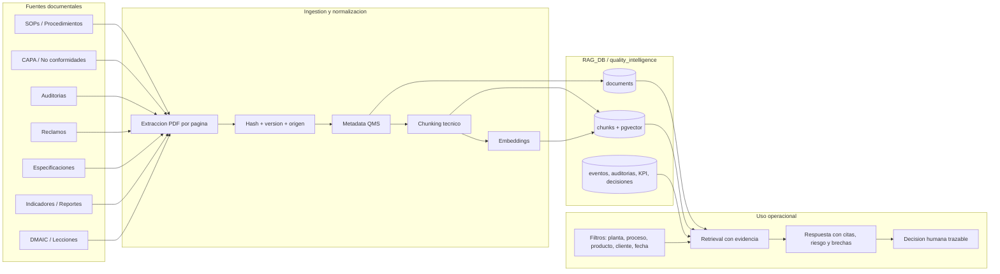

## 2. Diseno PostgreSQL

El esquema principal es `quality_intelligence` dentro de `RAG_DB`.

Tablas documentales centrales:

- `documents`: documento fuente, hash, path, tipo, revision, estado, fechas,
  owner, planta, proceso, producto, cliente, QMS process, riesgo y metadata.
- `chunks`: fragmentos con pagina, texto, embedding, seccion, clausula,
  requisito, paso de proceso, senal de riesgo y metadata.

Dimensiones operativas:

- `document_types`: SOP, CAPA, AUDIT, COMPLAINT, SPECIFICATION, DMAIC, KPI, QMS.
- `plants`, `processes`, `products`, `customers`.

Tablas de trazabilidad:

- `quality_events`: CAPA, no conformidades, desviaciones, reclamos, hallazgos.
- `document_event_links`: relacion entre documentos y eventos de calidad.
- `audit_records`: auditorias internas, externas, cliente o proveedor.
- `dmaic_projects`: proyectos de mejora continua.
- `operational_indicator_measurements`: mediciones KPI por periodo.
- `retrieval_sessions`: pregunta, filtros, perfil y respuesta.
- `retrieval_evidence`: evidencia usada por respuesta, score, pagina y chunk.
- `decision_records`: decisiones, racional, riesgo y evidencia asociada.

La migracion concreta esta en:

```text
sql/001_quality_intelligence_schema.sql
```

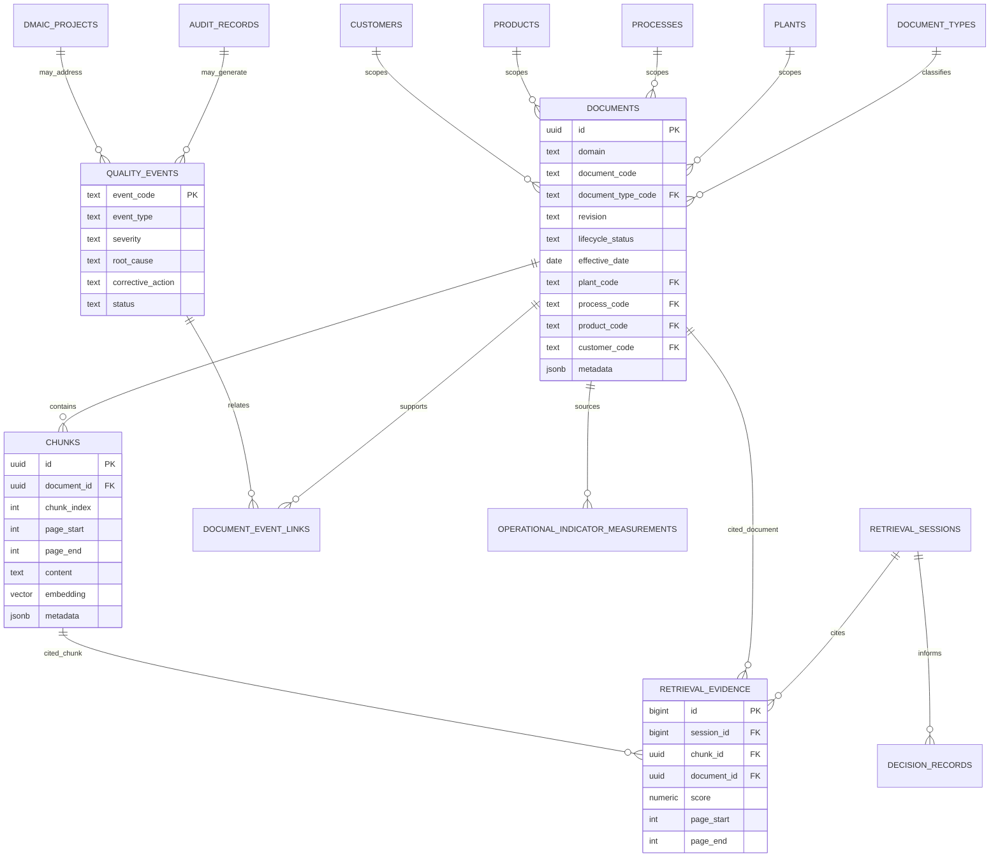

## 3. Metadata util para operaciones y QMS

Metadata minima por documento:

- `document_type`: SOP, CAPA, AUDIT, COMPLAINT, SPECIFICATION, etc.
- `document_code`, `revision`, `lifecycle_status`.
- `document_date`, `effective_date`, `review_due_date`.
- `plant`, `process`, `product`, `customer`.
- `owner_area`, `approved_by`, `approval_status`.
- `qms_process`, `standard_refs`, `regulatory_scope`.
- `risk_level`, `severity`, `criticality`.
- `source_system`, `source_record_id`, `content_hash`.

Metadata por chunk:

- `page_start`, `page_end`.
- `section_title`, `section_number`, `clause_ref`.
- `requirement_type`: shall, should, record, evidence, responsibility, action.
- `process_step`, `risk_signal`, `key_terms`.
- IDs detectados: CAPA, audit code, complaint code, product, SKU, batch, lot.

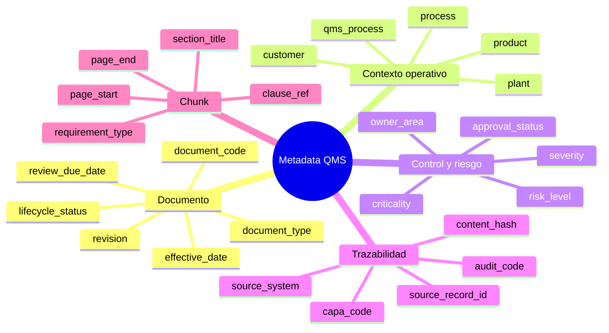

## 4. Tipos de documentos y clasificacion

Clasificacion inicial:

- SOP/procedimiento: reglas, pasos, responsabilidades, registros requeridos.
- Especificacion: limites, criterios de aceptacion, tolerancias, cliente.
- CAPA: problema, contencion, causa raiz, accion, verificacion de eficacia.
- Auditoria: criterio, evidencia, hallazgo, severidad, cierre.
- Reclamo: cliente, producto, lote, defecto, impacto, respuesta.
- Reporte de calidad: analisis, tendencias, conclusiones, recomendaciones.
- Leccion aprendida: contexto, evento, aprendizaje, aplicabilidad.
- DMAIC: problema, Y, baseline, meta, causas, soluciones, control plan.
- Indicador: metrica, periodo, meta, resultado, variacion, comentario.
- QMS: politica, manual, mapa de procesos, roles, compliance.

En demo se puede inferir desde el nombre del archivo. En produccion debe venir
del sistema maestro: QMS, ERP, MES, LIMS, CRM, auditorias o CAPA.

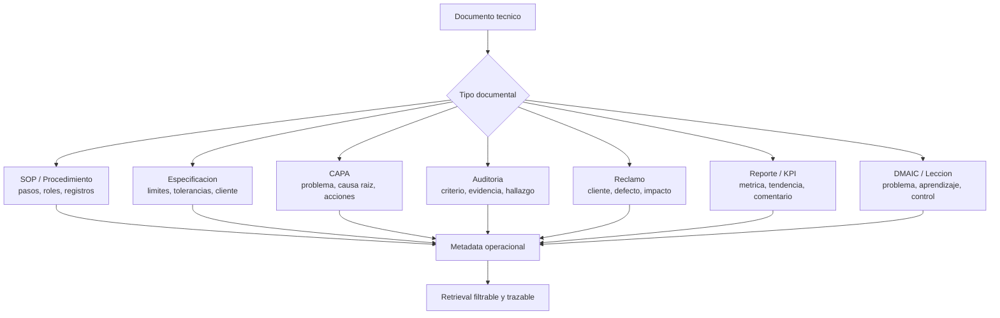

## 5. Flujos de retrieval relevantes

1. Cumplimiento de procedimiento:
   pregunta -> filtro planta/proceso/producto -> SOP/especificacion -> pasos,
   registros requeridos y responsable.
2. Investigacion CAPA:
   problema -> eventos similares -> causas raiz previas -> acciones efectivas
   -> riesgos de recurrencia.
3. Preparacion de auditoria:
   criterio -> procedimientos aplicables -> evidencias requeridas -> hallazgos
   historicos -> brechas.
4. Reclamo de cliente:
   cliente/producto/defecto -> especificaciones -> reclamos previos -> CAPA
   relacionadas -> respuesta basada en evidencia.
5. Cambio de proceso:
   proceso/producto -> procedimientos y controles -> riesgos -> indicadores
   afectados -> decisiones previas.
6. Revision de indicadores:
   KPI fuera de meta -> reportes -> eventos de calidad -> causas probables
   -> acciones abiertas.
7. Transferencia de aprendizaje:
   nuevo proyecto/problema -> lecciones aprendidas -> DMAIC similares ->
   controles que funcionaron.

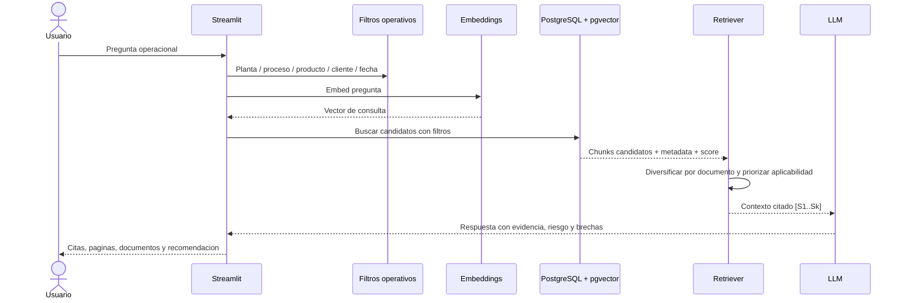

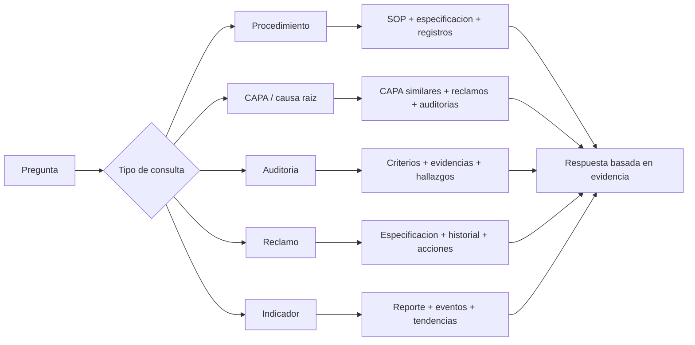

## 6. Preguntas que debe responder

- Que procedimiento aplica para liberar este producto en esta planta?
- Que evidencias exige el SOP para cerrar esta etapa?
- Que CAPA anteriores tuvieron una causa raiz parecida?
- Que hallazgos de auditoria se repiten por proceso?
- Que especificacion de cliente define el criterio de aceptacion?
- Que acciones correctivas fueron verificadas como efectivas?
- Que riesgos aparecen si cambio este parametro de proceso?
- Que documentos soportan la decision de aceptar/rechazar un lote?
- Que brechas de informacion impiden responder con confianza?
- Que documentos deben revisarse antes de una auditoria externa?

## 7. Trazabilidad, evidencia, contexto, riesgo y decisiones

Trazabilidad:

- Cada respuesta debe citar `[S1]`, `[S2]` con documento y pagina.
- Guardar `retrieval_sessions` y `retrieval_evidence` para auditoria.
- Usar `content_hash` para demostrar que la evidencia no cambio.

Evidencia:

- Mostrar texto citado, score, pagina, documento, revision y estado.
- Separar evidencia directa de inferencia.
- Indicar cuando la evidencia es insuficiente o esta vencida.

Contexto operativo:

- Filtros por planta, proceso, producto, cliente, auditoria y fecha.
- Metadata de QMS y eventos relacionada con cada documento.

Riesgo:

- Resumir impacto potencial en cliente, producto, proceso, compliance y costo.
- No convertir el modelo en aprobador automatico; debe soportar decision humana.

Causa raiz:

- Conectar CAPA, reclamos, auditorias y DMAIC por sintomas, causas y acciones.
- Diferenciar causa declarada, evidencia de causa y accion propuesta.

Decisiones:

- Generar una recomendacion con nivel de confianza documental.
- Registrar decision, racional, owner, fecha y evidencia usada.

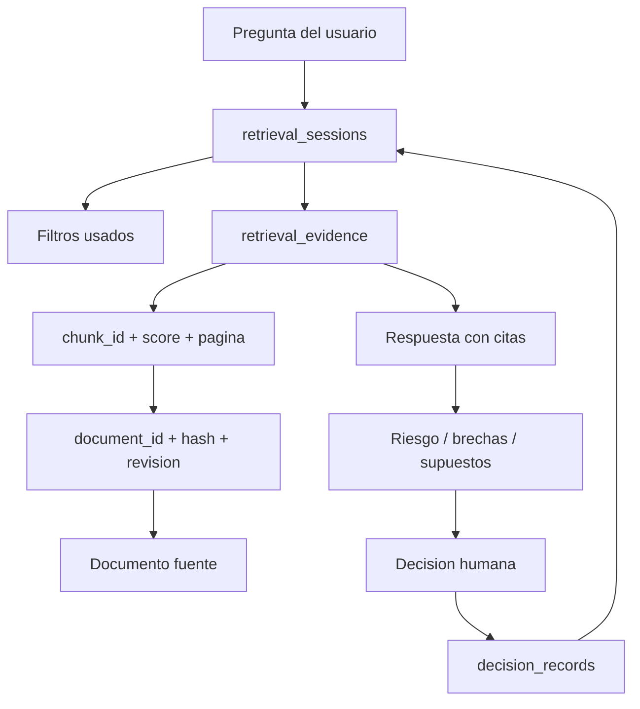

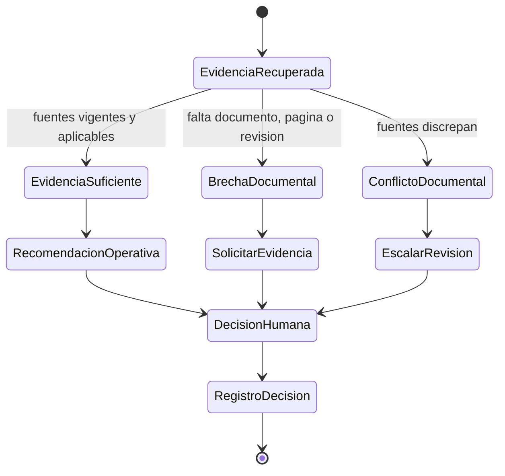

## 8. Mejoras para Streamlit UI

La UI debe parecer una herramienta operacional:

- Panel de filtros: planta, proceso, producto, cliente, tipo documental, auditoria, fecha.
- Vista de evidencia: citas por pagina, score, metadata y extracto.
- Modo de consulta: procedimiento, auditoria, CAPA, reclamo, especificacion, KPI.
- Panel de riesgo: severidad, recurrencia, evidencia disponible, brechas.
- Explorador documental: documentos indexados, revision, estado y owner.
- Historial de decisiones: pregunta, evidencia usada, decision y responsable.
- Export de briefing: resumen ejecutivo con citas para auditoria o reunion.

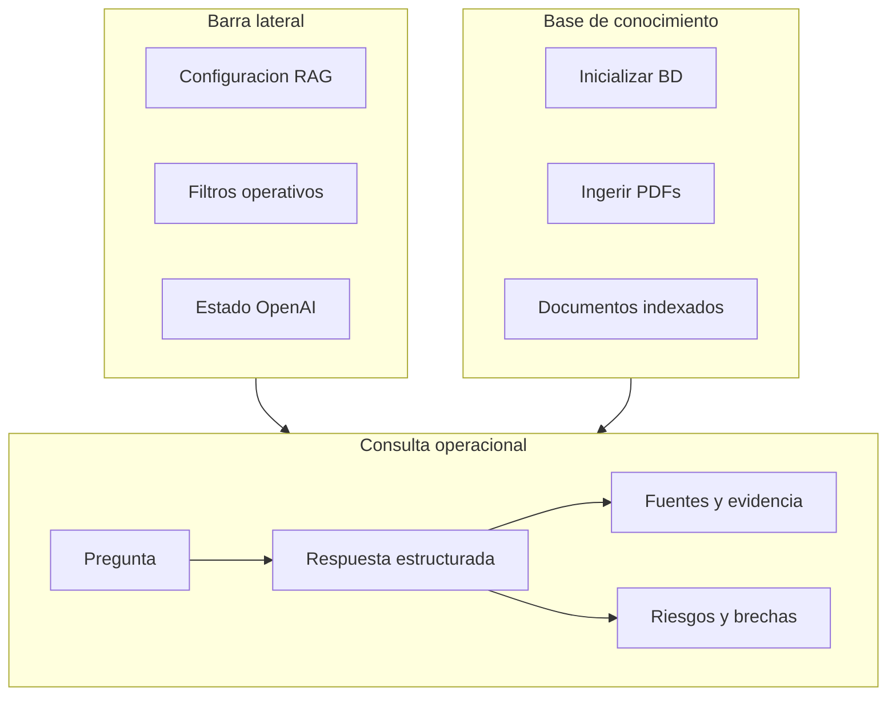

## 9. Como evitar que sea solo un chat

El producto debe iniciar desde una pregunta operacional, no desde una caja vacia.

Componentes clave:

- Filtros obligatorios o sugeridos para consultas de alto riesgo.
- Respuestas estructuradas: evidencia, interpretacion, riesgo, decision.
- Semaforos de suficiencia documental.
- Comparacion entre documentos: vigente vs obsoleto, SOP vs practica real.
- Registro de decisiones y evidencia.
- Tareas accionables: revisar documento, abrir CAPA, preparar auditoria,
  solicitar evidencia faltante.

## 10. Roadmap

Fase 1 - Base profesional:

- Perfil `quality_intelligence`.
- Esquema SQL QMS/trazabilidad.
- Ingestion de PDFs con metadata inicial.
- Filtros operativos en Streamlit.
- Citas por pagina/documento.

Fase 2 - Retrieval robusto:

- Metadata sidecar CSV/XLSX o carga desde QMS.
- Busqueda hibrida: vector + texto + filtros.
- Reranking por evidencia tecnica.
- Clasificacion automatica de chunks por seccion/requisito.

Fase 3 - Soporte a decisiones:

- Plantillas por caso: CAPA, auditoria, reclamo, cambio, liberacion.
- Registro de sesiones/evidencias/decisiones.
- Briefings exportables.
- Validaciones de documento vigente y aprobacion.

Fase 4 - Demo empresarial:

- Dataset simulado realista de calidad/manufactura.
- Casos guiados por planta, proceso y cliente.
- Dashboard de cobertura documental y riesgos.
- Historias: auditoria, reclamo cliente, CAPA recurrente, DMAIC.

Fase 5 - Producto Quality Analytics:

- Conectores a QMS/CAPA/auditorias/SharePoint/ERP.
- Roles y permisos.
- Monitoreo de calidad de retrieval.
- Evaluaciones con preguntas doradas.
- Deployment controlado para clientes.

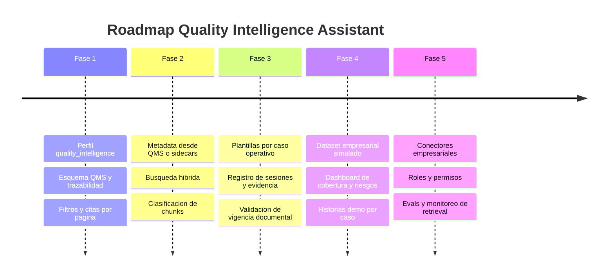

## 11. Portafolio, demo y producto

Portafolio profesional:

- Mostrar arquitectura, SQL, UI, pipeline y ejemplos de preguntas.
- Incluir 10-20 documentos simulados con metadata realista.
- Preparar capturas de casos: auditoria, reclamo, CAPA, SOP.

Demo empresarial:

- Usar una narrativa: "se recibio un reclamo de cliente por defecto X".
- Consultar especificacion, historial de reclamos, CAPA similares y SOP.
- Cerrar con recomendacion, riesgo y evidencia.

Producto Quality Analytics:

- Posicionarlo como inteligencia documental QMS + soporte a decisiones.
- Valor: reduce tiempo de busqueda, prepara auditorias, conecta CAPA/reclamos,
  evita decisiones sin evidencia y preserva trazabilidad.

## 12. Riesgos tecnicos y operativos

Tecnicos:

- Metadata incompleta reduce precision de filtros.
- PDFs escaneados requieren OCR; texto pobre genera chunks pobres.
- Embeddings no garantizan cumplimiento legal o tecnico.
- Vector search puede traer documentos semanticamente parecidos pero no aplicables.
- Cambios de dimension de embeddings obligan a reindexar.

Operativos:

- Documentos obsoletos pueden aparecer si no se filtra vigencia.
- Usuarios pueden tratar la respuesta como aprobacion formal.
- Informacion sensible de cliente/producto requiere control de acceso.
- Falta de versionado documental afecta auditoria.
- CAPA y reclamos necesitan contexto humano para confirmar causa raiz.

Controles:

- Citas obligatorias.
- Indicador de evidencia insuficiente.
- Filtro de documentos vigentes.
- Logs de decision.
- Evaluacion periodica con preguntas conocidas.

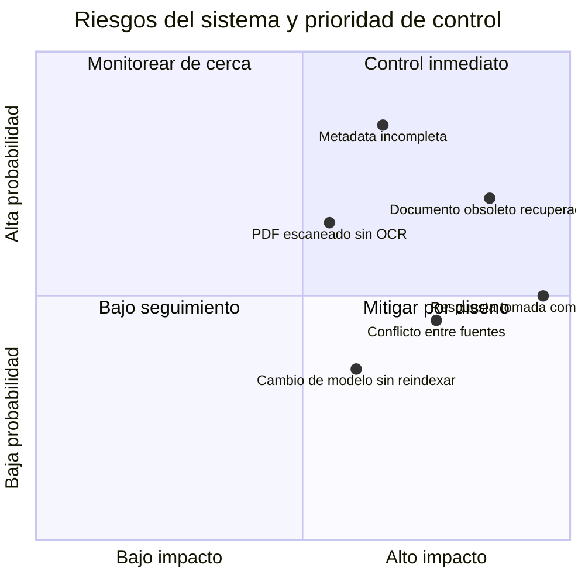

## 13. Embeddings, chunking y retrieval

Embeddings:

- Mantener dimension compatible con HNSW/IVFFLAT de pgvector.
- Reindexar al cambiar modelo o dimension.
- Separar corpus por dominio/esquema cuando haya contextos incompatibles.

Chunking:

- No cortar tablas o pasos criticos si se puede evitar.
- Preservar pagina, seccion, clausula y encabezados.
- Usar chunks de 1,000 a 2,500 caracteres para SOPs y CAPA; ajustar con pruebas.
- Overlap moderado para no perder contexto entre pasos.
- Agregar metadata de seccion y requisito cuando exista.

Retrieval:

- Usar filtros primero para aplicabilidad operacional.
- Traer mas candidatos que el top final y diversificar por documento.
- Combinar vector search con texto exacto para codigos, lotes, SKUs y normas.
- Rerankear cuando haya muchas fuentes similares.
- Penalizar documentos obsoletos o no aprobados.

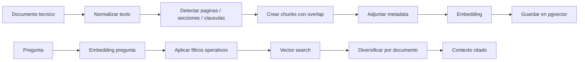

## 14. Filtros

Filtros principales:

- `plant`: sitio/planta.
- `process`: proceso, area o value stream.
- `product`: producto, SKU, familia.
- `customer`: cliente o segmento.
- `document_type`: SOP, CAPA, AUDIT, COMPLAINT, SPECIFICATION, etc.
- `audit`: codigo de auditoria o hallazgo.
- `date_from`, `date_to`: fecha documental o efectiva.

La app ya acepta estos filtros y los compara contra metadata JSONB o columnas
tipadas cuando existen.

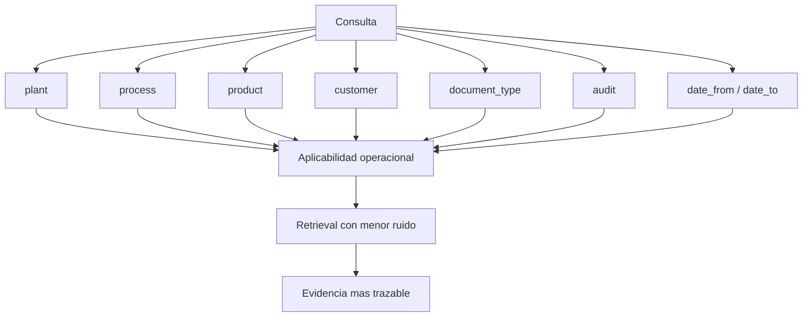

## 15. Citas y referencias trazables

Cada chunk guarda:

- `document_id`, `chunk_id`.
- `file_name`, `title`.
- `page_start`, `page_end`.
- `content_hash` en el documento.
- `metadata` documental y operativa.

Formato recomendado de cita:

```text
[S1] SOP-QA-014 rev.03, pp. 4-5, Planta Norte, Empaque
```

Reglas:

- Toda respuesta tecnica debe citar fuentes.
- No usar historial conversacional como evidencia.
- Si hay conflicto entre fuentes, mostrar ambos documentos y su vigencia.
- Si falta pagina, revision o estado, declararlo como brecha documental.
